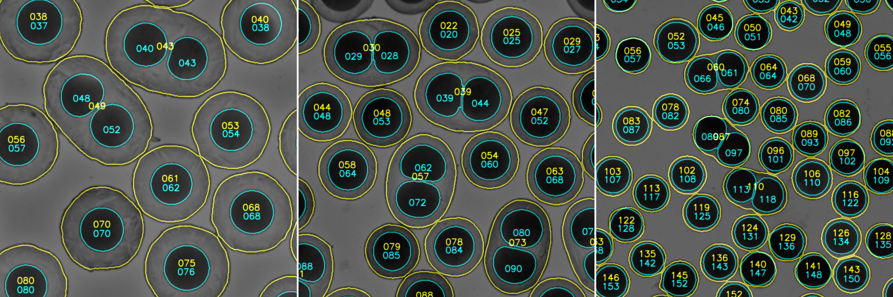

## Content

### main.py  
Processes either a selected image or all `jpg`, `png`, or `tif` images within 
the `data_path` folder and its subfolders. The rescaling factor `rf` can be 
adjusted to accelerate the post-prediction process. For each iteration, the 
procedure generates two CSV files (`cData.csv` and `sData.csv`) along with a 
display image (`display.png`), which are saved in the same location as the 
processed image. Refer to the [Outputs](#Outputs) section for further details.

```bash
# Paths
- data_path        # str, path to folder containing image(s) to process
- img_name         # str, image name or "all" for batch processing
```
```bash
# Parameters
- rf               # float, post-prediction rescaling factor (0 to 1)
- overlap          # int, prediction patches overlap (default 256)
- save             # bool, save or not outputs files 
```
```bash
# Outputs
- ..._cData.csv    # core data saved as csv
- ..._sData.csv    # shell data saved as csv
- ..._display.png  # display image 
```

### analyse.py
Compile data from different CSV files, including `tags_in` and excluding 
`tags_out` containing file name.

### Others
- **functions.py** - contains all required functions
- **environment-gpu.yml** - dependencies with GPU support (NVIDIA GPU required)
- **environment-nogpu.yml** - dependencies with no GPU support
- **model_cores_edt_512_gamma** - model files for core segmentation
- **model_shell_edt_512_gamma** - model files for shell segmentation

## Outputs

### display.png  
Image showing results of segmentation with detected **shells** in yellow and 
**cores** in cyan.



### cData.csv - inner cores data

```bash
# Core data
    - cLabel # core ID
    - cArea # area
    - cVolum # volume (assuming spherical shape)  
    - cPerim # perimeter
    - cFeret # max feret diameter
    - cMajor # fitted ellipse major axis length 
    - cMinor # fitted ellipse minor axis length
    - cSolid # solidity (object area / convex hull area)
    - cRound # roundness  
    - cCircl # circularity  
    - cY # centroid y position
    - cX # centroid x position
    - csRatio # core area / shell area
    - csDist # core to shell centroid distance

# Associated shell data
    - c_sLabel # associated shell ID
```

### sData.csv - outer shell data
```bash
# Shell data
    - sLabel # shell ID
    - sArea # area
    - sVolum # volume (assuming spherical shape)
    - sPerim # perimeter
    - sFeret # max feret diameter
    - sMajor # fitted ellipse major axis length 
    - sMinor # fitted ellipse minor axis length
    - sSolid # solidity (object area / convex hull area)
    - sRound # roundness
    - sCircl # circularity
    - sY # centroid y position
    - sX # centroid x position

# Associated core(s) data
    - sCore # number of associated core(s)
    - s_cLabel # core(s) ID
    - s_cArea # core(s) avg. area
    - s_cVolum # core(s) avg. volume
    - s_cPerim # core(s) avg. perimeter
    - s_cFeret # core(s) avg. max feret diameter
    - s_cMajor # core(s) avg. fitted ellipse major axis length 
    - s_cMinor # core(s) avg. fitted ellipse minor axis length
    - s_cSolid # core(s) avg. solidity
    - s_cRound # core(s) avg. roundness
    - s_cCircl # core(s) avg. circularity
    - s_csRatio # core(s) avg. core area / shell area
    - s_csDist # core(s) avg. core to shell centroid distance
```

```bash
# Volume = (4 / 3) * np.pi * np.sqrt(cArea / np.pi) ** 3
# Roundness = 4 * cArea / (np.pi * cMajor ** 2)
# Circularity = 4 * np.pi * cArea / cPerim ** 2
```